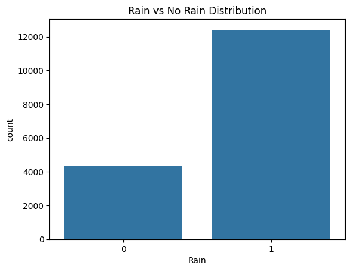
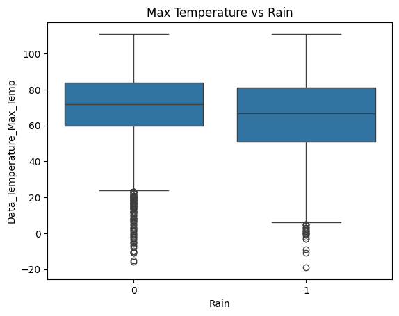
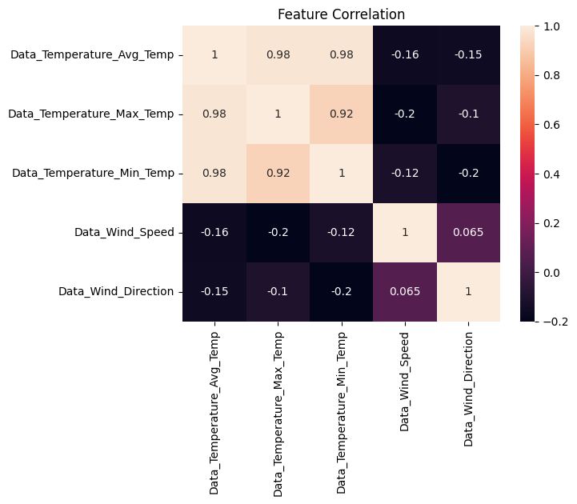

# Rainfall Prediction using Machine Learning

## Overview

This project builds a machine learning model to predict rainfall occurrence based on weather variables such as temperature and wind conditions.

## Problem Statement

Given daily weather conditions, predict whether rainfall will occur (binary classification problem).

## Dataset

* Weather dataset with temperature, wind, and precipitation variables
* Target variable created from precipitation:

  * Rain = 1 (if precipitation > 0)
  * Rain = 0 (otherwise)

## Methodology

### Data Preprocessing

* Cleaned column names
* Handled missing values
* Created binary target variable

### Features Used

* Average Temperature
* Maximum Temperature
* Minimum Temperature
* Wind Speed
* Wind Direction

### Models Implemented

* Logistic Regression
* Decision Tree
* Random Forest

## Results

| Model               | Accuracy  | Precision | Recall    | F1 Score  |
| ------------------- | --------- | --------- | --------- | --------- |
| Logistic Regression | 0.756     | 0.757     | 0.989     | 0.858     |
| Decision Tree       | 0.773     | 0.777     | 0.973     | 0.864     |
| Random Forest       | **0.792** | **0.798** | **0.963** | **0.873** |

## Key Insights

* Random Forest achieved the best performance
* Temperature variables were the most important predictors
* Maximum temperature had the highest influence on rainfall prediction

## Feature Importance (Random Forest)

* Max Temperature: 0.30
* Min Temperature: 0.22
* Avg Temperature: 0.16
* Wind Speed: 0.16
* Wind Direction: 0.16

## Sample Predictions

| Avg Temp | Max Temp | Min Temp | Wind Speed | Wind Dir | Predicted Rain | Probability |
| -------- | -------- | -------- | ---------- | -------- | -------------- | ----------- |
| 88       | 98       | 77       | 2.60       | 19       | 1              | 0.70        |
| 83       | 89       | 77       | 6.48       | 22       | 1              | 0.91        |
| 44       | 55       | 33       | 2.08       | 26       | 1              | 0.82        |
| 68       | 77       | 59       | 3.77       | 13       | 1              | 0.71        |
| 61       | 73       | 47       | 4.45       | 17       | 1              | 0.75        |

## Visualizations

### Rain Distribution

### Temperature vs Rain

### Feature Correlation

## Conclusion

The model successfully predicts rainfall using weather variables, demonstrating the effectiveness of machine learning for weather-based classification tasks.

## Limitations

* Model does not include humidity or pressure
* Predictions are based on statistical patterns, not physical models
* Performance may vary across regions

## Future Work

* Add humidity and pressure features
* Try advanced models like XGBoost
* Include temporal features (seasonality)

## Tools Used

* Python
* Pandas
* Scikit-learn
* Matplotlib / Seaborn

## Data Source

Dataset obtained from Kaggle:
https://www.kaggle.com/datasets/aiswaryasivakumar/rain-dataset

Original dataset by Aiswarya Sivakumar

## Author

Ashwin Jayakumar
